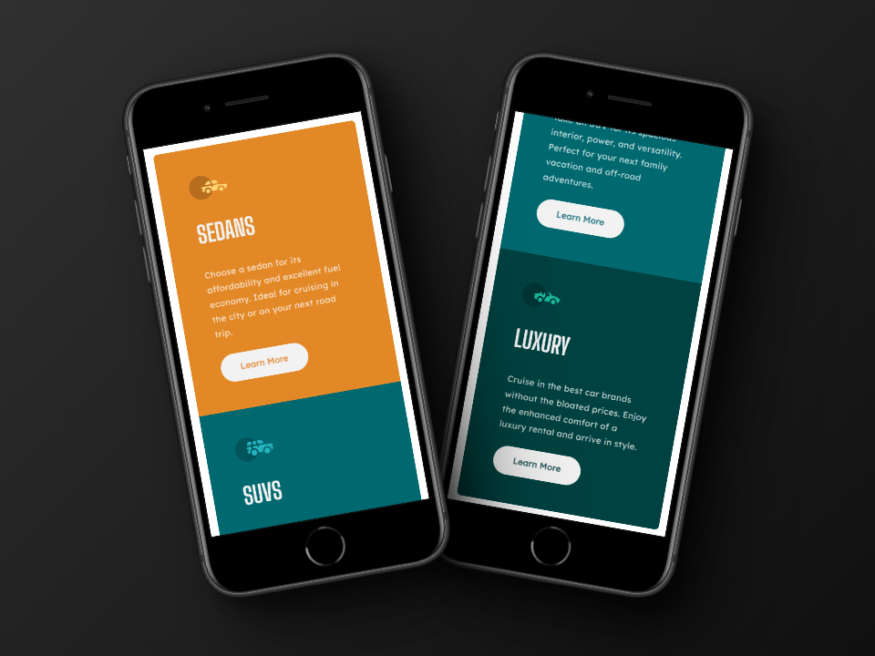
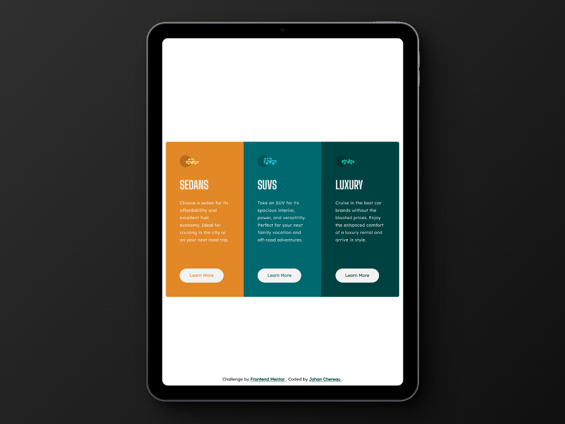
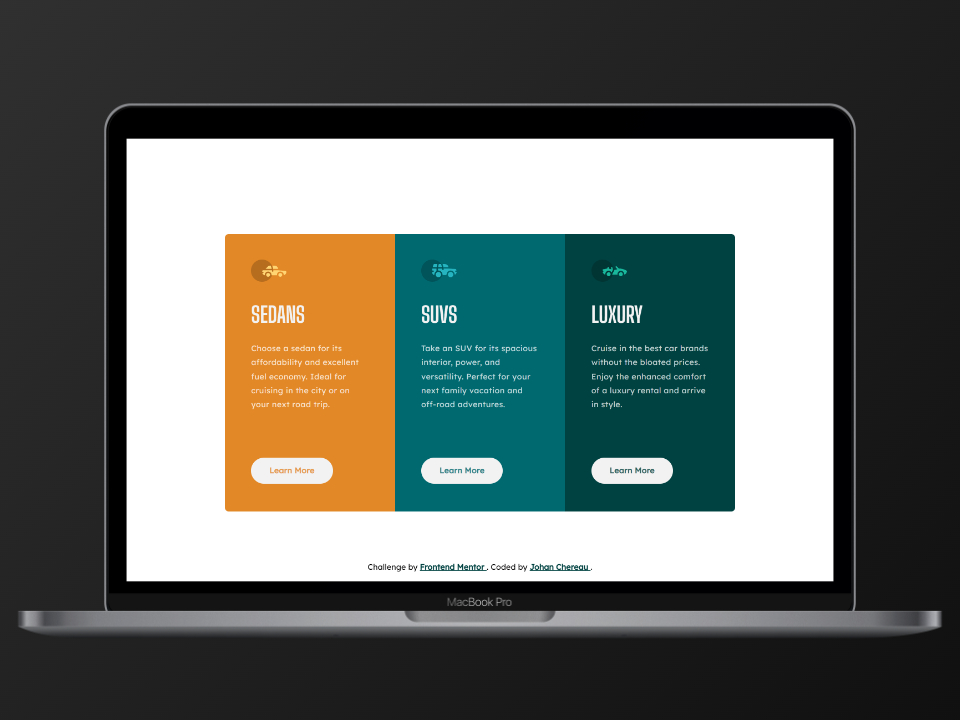

# Frontend Mentor - 3-column preview card component solution

This is a solution to the [3-column preview card component challenge on Frontend Mentor](https://www.frontendmentor.io/challenges/3column-preview-card-component-pH92eAR2-). Frontend Mentor challenges help you improve your coding skills by building realistic projects. 

## Table of contents

- [Overview](#overview)
  - [The challenge](#the-challenge)
  - [Design](#design)
  - [Screenshots](#screenshots)
  - [Links](#links)
- [My process](#my-process)
  - [Built with](#built-with)
  - [What I learned](#what-i-learned)
  - [Useful resources](#useful-resources)
- [Author](#author)
- [Acknowledgments](#acknowledgments)

## Overview

### The challenge

Users should be able to:

- View the optimal layout depending on their device's screen size
- See hover states for interactive elements

### Design

#### Design to integrate

### Screenshots

#### Mobile view

#### Tablet view

#### Laptop view

### Links

- Solution on Front End Mentor: [Click here]()
- Live Site URL: [Click here]()

## My process

### Built with

- Semantic HTML5 markup
- CSS custom properties
- CSS Grid
- Mobile-first workflow
- BEM (Block, Element, Modifier)

### Useful resources

- [CSS-Tricks : CSS Grid](https://css-tricks.com/snippets/css/complete-guide-grid/) - Guide to all CSS grid properties, with examples.

## Author

- Frontend Mentor - [@JohanChereau](https://www.frontendmentor.io/profile/JohanChereau)